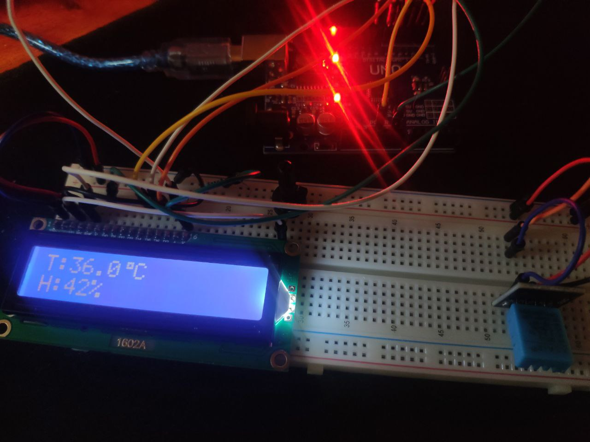

# Arduino-Weather-Monitor

This project uses an Arduino, a DHT11 temperature and humidity sensor, and a 16x2 LCD display to monitor and display environmental conditions.

## Components
- Arduino Uno mini
- DHT11 sensor
- LCD 16x2 display

## Libraries
- `DHT sensor library` by Adafruit
- `LiquidCrystal library` (usually comes pre-installed with the Arduino IDE)

## Features
- Real-time temperature and humidity monitoring
- Display readings on an LCD screen

## Setup
1. Connect the DHT11 sensor to pin 2 of the Arduino Uno.
2. Connect the LCD 16x2 display to pins 3, 4, 5, 6, 7, and 8 of the Arduino Uno.
3. Upload the provided code to your Arduino Uno.

## Images

